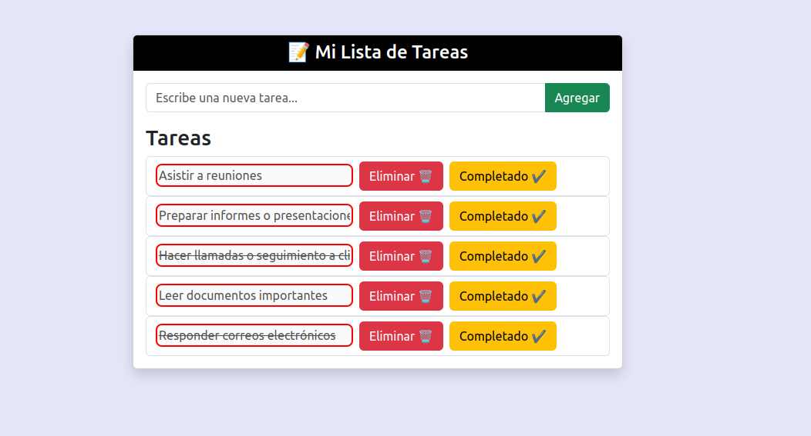

# 📝 To-Do List

Este proyecto es un **To-Do List interactiva** desarrollada con **HTML5, (Bootstrap)** y **JavaScript**, ideal para practicar lógica, manipulación del DOM y programación orientada a objetos (POO).

## 🎯 Características

- Agregar nuevas tareas
- Buscar tareas en tiempo real
- Filtrar por estado: Todos, Pendientes o Completados
- Marcar tareas como completadas
- Eliminar tareas
- Interfaz responsive y amigable con Bootstrap 5

## 🛠️ Tecnologías utilizadas

- HTML5
- Bootstrap 5
- JavaScript moderno (ES6+)
- localStorage para persistencia de datos

## 📸 Demo

